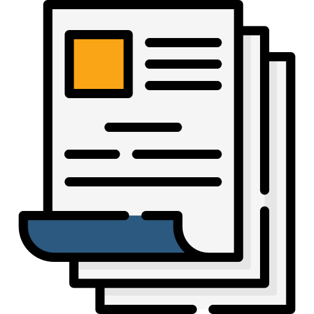

<h1 align="center" id="documentos">Automatizar Documentos</h1>

## Insignias

## Índice

1. [Automatizar Documentos](#documentos)

2. [Insignias](#insignias)

3. [Índice](#índice)

4. [Descripción del proyecto](#descripción-del-proyecto)

5. [Estado del proyecto](#Estado-del-proyecto)

6. [Características de la aplicación y demostración](#Características-de-la-aplicación-y-demostración)

7. [Acceso al proyecto](#acceso-proyecto)

8. [Tecnologías utilizadas](#tecnologías-utilizadas)

9. [Personas-Desarrolladores del Proyecto](#personas-desarrolladores)

10. [Conclusión](#conclusión)

## Descripción del proyecto

Proyecto de Python que automatiza la creación de documentos extrayendo la información de una hoja de calculo (excel) y generando un documento de Word por cada registro.

## Estado del proyecto

<h4 align="center">
FINALIZADO
</h4>

## Características de la aplicación y demostración.

> Uso.

    - Diccionarios
    - Constantes
    - Ciclos
    - Pandas
    - Templates

## Acceso al proyecto

> Extenciones

pip install docxtpl  
pip install pandas  
pip install openpyxl  
pip install wheel

[Descarga los archivos desde Github]()

## Tecnologías utilizadas

## Personas-Desarrolladores del Proyecto

| [ Cesar Lopez Orihuela Alves](https://github.com/Chinicuil87)
