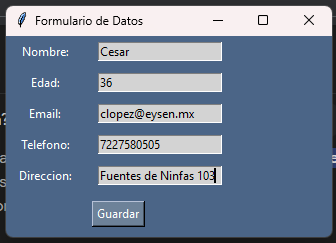
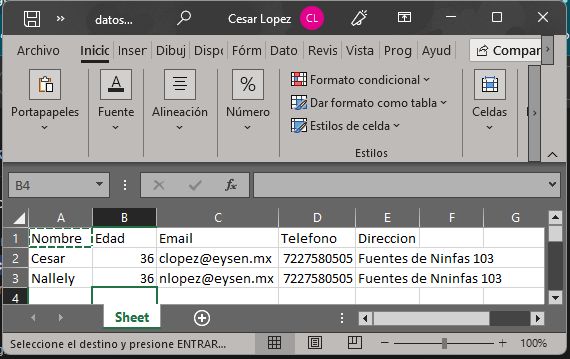
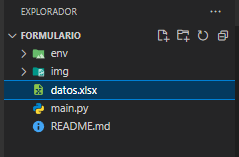

<h1 align="center" id="formulario">Formulario</h1>

## Insignias

<section align="center">

</section>

## Índice

1. [Formulario](#formulario)

2. [Insignias](#insignias)

3. [Índice](#índice)

4. [Proyectos y Ejercicios](#descripción-del-proyecto)

5. [Acceso al proyecto](#acceso-proyecto)

6. [Tecnologías utilizadas](#tecnologías-utilizadas)

7. [Personas-Desarrolladores del Proyecto](#personas-desarrolladores)

8. [Conclusión](#conclusión)

## Descripción del proyecto

Aplicacion de escrotorio, que muestra un formalurio y guarda la informacion capturada en un excel.

## Estado del proyecto

<h4 align="center">
FINALIZADO
</h4>

## Características de la aplicación y demostración.

Aplicacion de escritorio

> Lenguaje Python

    - Tkinter  (ventanas)
    - openpyxl (archivos excel)

> Vista escritorio

> Vista archivo

## Acceso al proyecto

[Github](https://github.com/Chinicuil87/programacionpython/tree/main/formulario)

## Tecnologías utilizadas

## Personas-Desarrolladores del Proyecto

| [ Cesar Lopez Orihuela Alves](https://github.com/Chinicuil87)

pip install openpyxl
