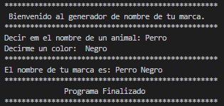

<h1 align="center" id="marca">Nombre de tu marca</h1>

## Insignias

<section align="center">

</section>

## Índice

1. [Nombre de tu marca](#marca)

2. [Insignias](#insignias)

3. [Índice](#índice)

4. [Descripción del proyecto](#descripción-del-proyecto)

5. [Estado del proyecto](#Estado-del-proyecto)

6. [Instructor.](#instructor)

7. [Curso](#curso)

8. [Características de la aplicación y demostración](#Características-de-la-aplicación-y-demostración)

9. [Repositorio Proyecto](#acceso-proyecto)

10. [Tecnologías utilizadas](#tecnologías-utilizadas)

11. [Desarrollador](#desarrollador)

12. [Redes Sociales](#redes)

## Descripción del proyecto

Programa de consola.

Vas a crear un código en Python que le pida a tu amigo que responda dos preguntas que
requieran una sola palabra cada una y que luego le muestre en pantalla esas palabras
combinadas, para formar una marca creativa.
Puedes usar las preguntas que quieras. La idea es que el resultado sea original, creativo, y hasta
cómico, y si quieres agregar dificultad al desafío, te sugiero que intentes que el nombre de la
cerveza se imprima entre comillas. Recuerda que hay diferentes formas de que la función print
muestre las comillas sin cortar el string, y que ingrese la impresión final en al menos dos líneas
utilizando saltos de línea dentro del código.
Intenta hacerlo por tu cuenta y si se complica, no te preocupes, en la próxima elección lo vamos
a resolver juntos.

## Estado del proyecto

<h4 align="center">
FINALIZADO
</h4>

## Instructor.

> Ing. Federico Garay.

## Curso.

> Python TOTAL - Programador Avanzado en 16 días.

## Liga.

<section align="center">

</section>

## Características de la aplicación y demostración.

> Lenguaje

    PYTHON

> Uso

    - variables
    - print
    - input

> Aplicacion de consola

Resultado.

](img/image.png)

## Repositorio Proyecto

[Github](https://github.com/Chinicuil87/programacionpython/tree/main/proyecto1)

## Tecnologías utilizadas

<section align="center">

  

</section>

## Desarrollador

<section align="center">

[ Cesar Lopez Orihuela](https://github.com/Chinicuil87)

</section>

## Redes Sociales.

<section align="center">

</section>
