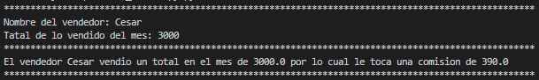

<h1 align="center" id="comision">Comision</h1>

## Insignias

<section align="center">

</section>

## Índice

1. [Comision](#marca)

2. [Insignias](#insignias)

3. [Índice](#índice)

4. [Descripción del proyecto](#descripción-del-proyecto)

5. [Estado del proyecto](#Estado-del-proyecto)

6. [Características de la aplicación y demostración](#Características-de-la-aplicación-y-demostración)

7. [Acceso al proyecto](#acceso-proyecto)

8. [Tecnologías utilizadas](#tecnologías-utilizadas)

9. [Personas-Desarrolladores del Proyecto](#personas-desarrolladores)

10. [Conclusión](#conclusión)

## Descripción del proyecto

Programa de consola.

Este programa debería comenzar preguntando cosas al usuario, por lo tanto, vas a
necesitar input para poder recibir los ingresos del usuario y deberías usar variables para
almacenar esos ingresos. Recuerda que los ingresos de usuarios se almacenan como
strings. Por lo tanto, deberías convertir uno de esos ingresos en un float para poder hacer
operaciones con él.
 ¿Y qué operaciones necesitas hacer? Bueno, calcular el 13% del número que haya
ingresado el usuario. Es decir, que debes multiplicar ese número por 13 y luego dividirlo
por 100. Recuerda almacenar ese resultado en una variable.
 Sería bueno que para imprimir en pantalla el resultado te asegures de que esa
información no tenga más de dos decimales, para que sea fácil de leer, y luego organiza
todo eso en un string al que debes dar formato. Recuerda que conocimos dos maneras
de hacerlo y cualquiera de ellas es válida.

## Estado del proyecto

<h4 align="center">
FINALIZADO
</h4>

## Características de la aplicación y demostración.

> Aplicacion consola.

> Lenguaje

    PYTHON

> Uso

    - variables
    - print
    - input

> Aplicacion de consola

Resultado.

## Acceso al proyecto

[Github](https://github.com/Chinicuil87/programacionpython/tree/main/proyecto_2)

## Tecnologías utilizadas

<section align="center">

  

</section>

## Personas-Desarrolladores del Proyecto

<section align="center">

[ Cesar Lopez Orihuela](https://github.com/Chinicuil87)

</section>
