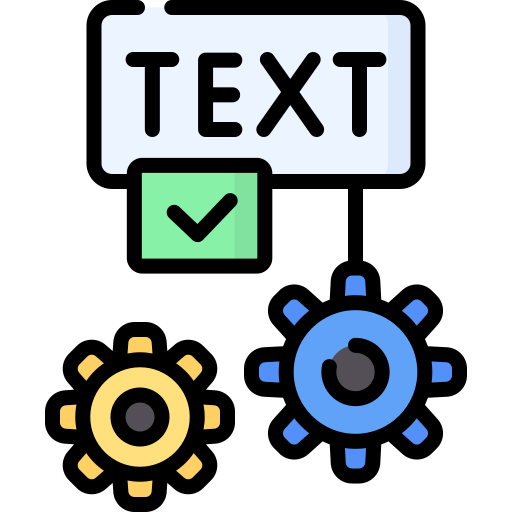
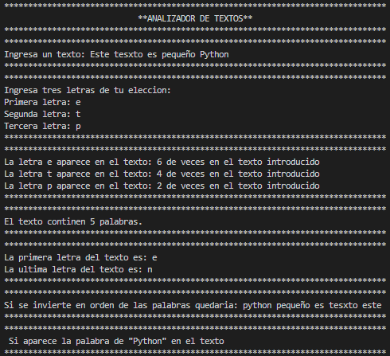

<h1 align="center" id="texto">Analizador de Texto</h1>

## Insignias

<section align="center">

</section>

## Índice

1. [Analizador de Texto](#texto)

2. [Insignias](#insignias)

3. [Índice](#índice)

4. [Descripción del proyecto](#descripción-del-proyecto)

5. [Estado del proyecto](#Estado-del-proyecto)

6. [Características de la aplicación y demostración](#Características-de-la-aplicación-y-demostración)

7. [Acceso al proyecto](#acceso-proyecto)

8. [Tecnologías utilizadas](#tecnologías-utilizadas)

9. [Personas-Desarrolladores del Proyecto](#personas-desarrolladores)

10. [Conclusión](#conclusión)

## Descripción del proyecto

La consigna es la siguiente: vas a crear un programa que primero le pida al usuario que
ingrese un texto. Puede ser un texto cualquiera: un artículo entero, un párrafo, una frase, un
poema, lo que quiera. Luego, el programa le va a pedir al usuario que también ingrese tres
letras a su elección y a partir de ese momento nuestro código va a procesar esa información
para hacer cinco tipos de análisis y devolverle al usuario la siguiente información:

1. Primero: ¿cuántas veces aparece cada una de las letras que eligió? Para lograr esto, te
   recomiendo almacenar esas letras en una lista y luego usar algún método propio de string
   que nos permita contar cuantas veces aparece un sub string dentro del string. Algo que
   debes tener en cuenta es que al buscar las letras pueden haber mayúsculas y minúsculas
   y esto va a afectar el resultado. Lo que deberías hacer para asegurarte de que se
   encuentren absolutamente todas las letras es pasar, tanto el texto original como las
   letras a buscar, a minúsculas.
2. Segundo: le vas a decir al usuario cuántas palabras hay a lo largo de todo el texto. Y
   para lograr esta parte, recuerda que hay un método de string que permite transformarlo
   en una lista y que luego hay una función que permite averiguar el largo de una lista.
3. Tercero: nos va a informar cuál es la primera letra del texto y cuál es la última. Aquí
   claramente echaremos mano de la indexación.
4. Cuarto: el sistema nos va a mostrar cómo quedaría el texto si invirtiéramos el orden de
   las palabras. ¿Acaso hay algún método que permita invertir el orden de una lista, y otro
   que permita unir esos elementos con espacios intermedios? Piénsalo.
5. Y por último: el sistema nos va a decir si la palabra “Python” se encuentra dentro del
   texto. Esta parte puede ser algo complicada de imaginársela, pero te voy a dar una pista:
   puedes usar booleanos para hacer tu averiguación y un diccionario para encontrar la
   manera de expresarle al usuario tu respuesta.

## Estado del proyecto

<h4 align="center">
FINALIZADO
</h4>

## Características de la aplicación y demostración.

> Aplicacion consola.

> Lenguaje

    PYTHON

> Uso

    - variables
    - print
    - input
    - metodos

> Aplicacion de consola

Resultado.

## Acceso al proyecto

[Github](https://github.com/Chinicuil87/programacionpython/tree/main/proyecto_3)

## Tecnologías utilizadas

<section align="center">

  

</section>

## Personas-Desarrolladores del Proyecto

<section align="center">

[ Cesar Lopez Orihuela](https://github.com/Chinicuil87)

</section>
